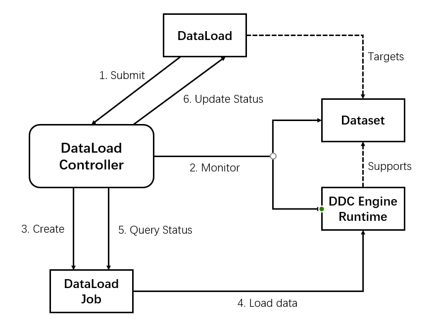

<!-- START doctoc generated TOC please keep comment here to allow auto update -->
<!-- DON'T EDIT THIS SECTION, INSTEAD RE-RUN doctoc TO UPDATE -->
**Table of Contents**  *generated with [DocToc](https://github.com/thlorenz/doctoc)*

- [Motivation](#motivation)
- [Goals](#goals)
- [Non-Goals](#non-goals)
- [API](#api)
  - [DataLoad CRD](#dataload-crd)
  - [DataLoad.Status](#dataloadstatus)
- [Workflow](#workflow)
- [Test](#test)
- [Alternative Considered](#alternative-considered)
- [Commits](#commits)

<!-- END doctoc generated TOC please keep comment here to allow auto update -->

## Motivation

为了保证应用在使用数据集时保持较高的资源利用率，保障应用的性能，Fluid应当为用户提供**数据预热**的支持。根据用户需要，Fluid需要将用户部署的数据集提前加载进分布式数据缓存引擎中，使得应用在访问对应的数据集时，不再需要从远程存储系统拉取，以保证应用的数据访问能力,避免计算资源等待IO的情况频繁发生，提高计算资源利用率

数据预热是一个与用户需求强相关的功能特性，用户应当根据自身需求决定：
1. 是否进行数据预热？
2. 何时进行数据预热？
3. 数据预热中待预热的目标数据是什么？
4. 对目标数据进行怎样的预热？（例如，预热时选择多少replication等）

考虑到数据预热在实际场景的复杂性，我们需要实现一个额外的CRD对数据预热的行为进行描述，并将此CRD作为API供用户进行配置。同时，需要额外实现一个新的Controller，对该CRD进行生命周期管理，信息维护和更新，并按用户描述的数据预热行为做出相应的数据加载行为。

## Goals
- 提供对数据预热支持，为用户提供控制数据预热行为的API接口
- 根据用户的描述完成数据预热
- 数据预热整个过程可被观测，用户可了解到预热的状态
- 支持仅预热部分指定数据
- 支持数据预热时加载至分布式缓存引擎的副本数量
- 可多次重复执行的数据预热

## Non-Goals
- 暂不支持在数据预热时，将数据加载至各个Dataset部署结点的Kernel Cache中的操作
- 暂不支持定时执行数据预热(类似于CronJob)
- 暂不支持在同个数据集上并发执行多个数据预热任务

## API

### DataLoad CRD
```yaml
apiVersion: data.fluid.io/v1alpha1
kind: DataLoad
metadata:
  name: dataload-job1
spec:
  dataset:
    name: dataset
    namespace: default
  loadMetadata: true
  target:
    - path: /train
      replicas: 2
    - path: /test
      replicas: 1
```

该DataLoad CRD的`spec`属性中包括：
- dataset: 需要进行数据预热的Dataset的描述
  - name: 需要进行数据预热的Dataset的名字
  - namespace: 需要进行数据预热的Dataset所在的命名空间，默认设为default
- target: 需要进行数据预热的目标数据的描述，为一个数组，每个数组元素包括:
  - path: 需要进行数据预热的目标数据在分布式缓存引擎中的路径
  - replicas: 该目标数据在数据预热时加载至分布式缓存的数据副本数量

### DataLoad.Status
```yaml
apiVersion: data.fluid.io/v1alpha1
kind: DataLoad
metadata:
  name: dataload-job1
spec:
  ...
status:
  startTime: "2020-10-22T02:31:21Z"
  completionTime: "2020-10-22T02:33:10Z"
  conditions:
  - lastProbeTime: "2020-10-22T02:33:10Z"
    lastTransitionTime: "2020-10-22T02:33:10Z"
    status: "True"
    type: Complete
  phase: Loaded
```
`phase`属性持久化地记录DataLoad的执行状态，包含以下几个阶段：
- PhaseNone = "": 初始状态
- PhasePending = "Pending", 表示数据预热未开始，正处于等待状态
- PhaseLoading = "Loading", 表示正在进行数据预热
- PhaseLoaded = "Loaded", 表示数据预热已完成
- PhaseFailed = "Failed"， 表示数据预热失败

## Workflow



1. 用户在希望进行数据预热时，提交DataLoad CRD，定义此次数据预热的行为

2. DataLoad controller依据DataLoad CRD中的`dataset`描述(name和namespace信息)，获得对应的Dataset对象,检查该Dataset状态，如果准备就绪，转向步骤3，否则等待Dataset准备就绪

3. 检查是否存在在相同目标数据集上运行（即`status.phase`=`PhaseLoading`）的数据预热任务，如果存在,等待其完成;如果不存在，则转向步骤4
   
4. DataLoad controller创建一个Job对象
   
5. 如果`loadMetadata`为true，则该Job首先进行文件元信息加载，待元信息加载完成后，按`target`中定义的目标数据顺序执行分布式数据加载。
    
    分布式数据加载依据Dataset底层的分布式缓存引擎使用不同的实现。例如, 对于AlluxioRuntime, 在创建的Job中执行`alluxio fs distributedLoad --replication <target[i].replicas> <target[i].path>`。

    > Notes: 当`alluxio fs distributedLoad`指定的数据副本数量大于文件所设置的最大副本数量时，这些额外加载的副本会被迅速驱逐，因此在进行分布式数据加载前，需要检查并设置合适的最大副本数量

6. DataLoad controller周期性查询Job运行状态

7. 根据Job运行状态更新DataLoad对象中的状态

## Test

验证目标：

1. 分布式加载过程可通过查看数据缓存情况被观测
2. 通过`alluxio fs ls`可验证仅部分数据被成功加载的结果
3. `status.phase`应当与整个数据预热过程保持一致

## Alternative Considered 
对于Alluxio缓存引擎进行分布式数据缓存加载的另一种实现方案为`alluxio setReplication --min <target[i].replicas> <target[i].path>`，这种方案面临两个问题：
  
  1. 无法准确知晓数据的分布式加载是否已经完成
  2. 改变了Alluxio中被加载文件的`minReplication`,可能会导致这部分数据长期留存，不会被Evict

对于Alluxio这种分布式数据缓存引擎，我们使用`alluxio fs distributedLoad`作为数据预热的实现，目前该命令是同步的，更好的方案或许为异步的分布式数据加载，这需要Alluxio提供额外的支持

另外，是否在DataLoad CRD中提供更细粒度的缓存副本数量控制(e.g. 允许用户设置min和max)需要进一步讨论
## Commits

