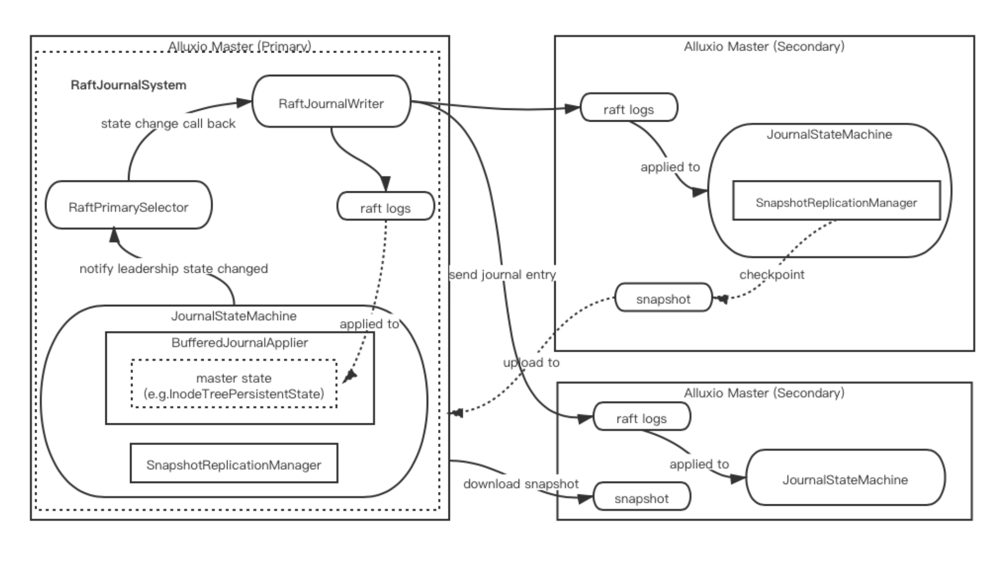

# Support Master High-Avaliable

## Motivation
In Alluxio and Jindo runtime, master pod as the key role in architecture. The leading master is responsible for managing the global metadata of the filesystem. In production environment，if the leading master is schedulered to a node which is a unstable node, or some other unknown failure make leading master not work.And the alluxio community provides HA mode for fault-tolerance for leading master. As a control plane, we need provided ha interface for cache engine.
## Goal
We provided an interface for cache engine support HA mode, in this design we only provide the implement of Alluxio engine. Alluxio support two different ways for maintaing the shared file system state across service restart and maintaing consensus among masters on leading master after failover. The first one is raft-based journal, the other is zookeeper with shared journal.And the last way, alluxio community will not provide the long-term support. So in fluid, we only support raft-based journal.The process of implementing high availability of master based on raft by Alluxio is as follow：

## Non-Goal
Support other consistent component interface like zookeeper.
## Design

### Alluxio

#### Alluxio configure raft embedded journal：
1. setting journal file address，`alluxio.master.journal.folder=/local/path/to/store/journal/files/` default is `${alluxio.work.dir}/journal`
2. open master journal communication port `alluxio.master.embedded.journal.port` default is  19200
3. setting master embedded journal address `alluxio.master.embedded.journal.addresses` scheme like master_hostname_1:19200,master_hostname_2:19200,master_hostname_3:19200

### Fluid

#### alluxio master interface
1. We need add attribute for replicas for master
2. Providing function for auto generate embedded journal addresses
3. Supporting different ways for storing embedded journal (e.g., pvc or memory)
4. If use pvc for storing, need delete pvc when delete runtime.

#### Other Considerations
1. DataBackup reconcile process needs which node is the leading master.
2. If we support pvc to store raft journal, we need an attribute for storageclass, now is standard. 

### Releated commits

