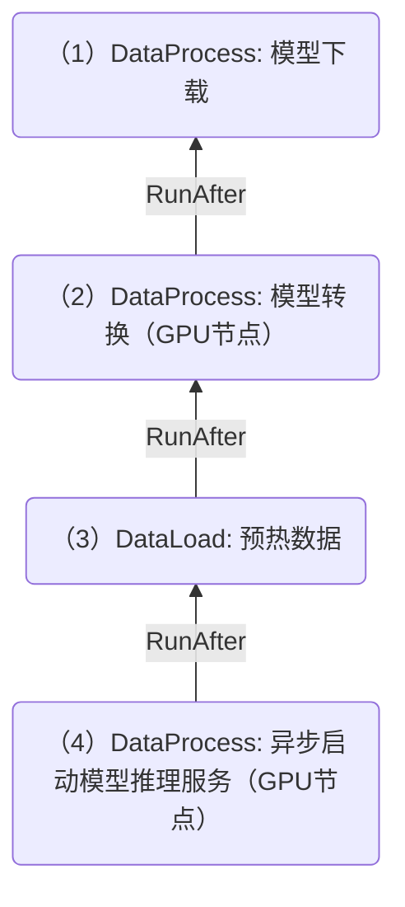

# DataFlow 的亲和性支持指定的前置操作

## 动机

当前`AffinityStrategy`字段位于`RunAfter`对应的结构体中，因此亲和性只能依赖于`RunAfter`所对应的前置的数据操作。

对于有些场景，如下的 DataFlow 存在使用非直接的前置操作的亲和性：

- 第（4）步的 DataProcess 要求跟 第（2）步的 DataProcess 使用同样的GPU节点。




## 目标

DataFlow 中的数据操作的亲和性，可以指定依赖任意的前置操作。


## 设计

> 字段改动，因此当前设计对 v1.0.1 和 v1.0.2 的 DataFlow Affinity 不兼容。
>
> - （待确定）如果不将`AffinityStrategy`从`RunAfter`中移出，可以兼容旧版本，语义和层级上是否合理？

当前 `AffinityStrategy`字段位于`RunAfter`字段中，仅能依赖`RunAfter`指定的数据操作。

**将 `AffinityStrategy`字段从`RunAfter`中分离出来**，并添加依赖的前置数据操作的字段 `DependOn *OperationRef`。

- 对于 Data Operation 注入亲和性时，不根据 `RunAfter` 表示的前置操作，而是根据 `AffinityStrategy`中的`DependOn`所表示的操作。

  - 由用户来保证`DependOn *OperationRef` 是前置的数据操作。
  - **（待确定）如果没有指定`DependOn`，使用 `RunAfter`字段表示的前置数据操作**。

```go
type DataLoadSpec struct {
    // Specifies that the preceding operation in a workflow
	// +optional
	RunAfter *OperationRef `json:"runAfter,omitempty"`

    // Modified. move out from OperationRef.
	// AffinityStrategy specifies the pod affinity strategy with the referent operation.
	// +optional
	AffinityStrategy *AffinityStrategy `json:"affinityStrategy,omitempty"`
}

type AffinityStrategy struct {
	// Added
    // Specifies that the dependent preceding operation in a workflow. If not set, use `RunAfter` field.
	// +optional
	DependOn *OperationRef `json:"dependOn,omitempty"`
	// Policy one of: "", "Require", "Prefer"
	// +optional
	Policy AffinityPolicy `json:"policy,omitempty"`

	Prefers  []Prefer  `json:"prefers,omitempty"`
	Requires []Require `json:"requires,omitempty"`
}

```


## 示例

针对示例的工作流


Yaml 的示例配置信息如下

```yaml
apiVersion: data.fluid.io/v1alpha1
kind: DataProcess
metadata:
  name: step2-trtllm-convert
  # exposed affinity which will be filled in OperationStatus.
  fluid.io/affinity.labels: "node.kubernetes.io/instance-type"
spec:
  runAfter:
    kind: DataProcess
    name: step1-download-model
    namespace: default
  ... 
---
apiVersion: data.fluid.io/v1alpha1
kind: DataLoad
metadata:
  name: step3-warmup-cache
spec:
  runAfter:
    kind: DataProcess
    name: step2-trtllm-convert
    namespace: default
  ... 
---
apiVersion: data.fluid.io/v1alpha1
kind: DataProcess
metadata:
  name: step4-infer-server
spec:
  runAfter:
    kind: DataLoad
    name: step3-warmup-cache
    namespace: default
  AffinityStrategy:
    # get affinity from which data operation
  	dependOn:
      kind: DataProcess
      name: step2-trtllm-convert
      namespace: default
  	policy: Require
      # Require to run on a node with the same label value as the dependent operation
      requires: 
      - name: node.kubernetes.io/instance-type
```

