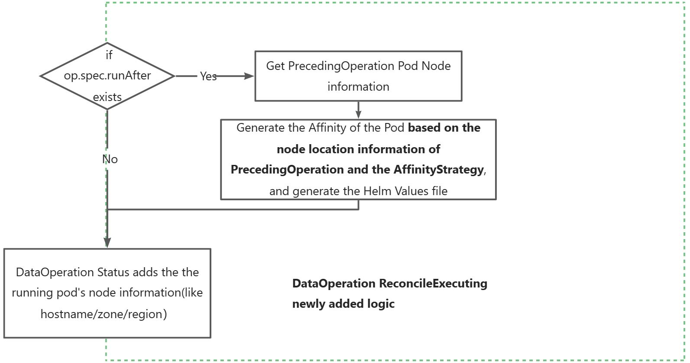

# The affinity between Data Operation Pods in DataFlow

## Motivation
Currently, Fluid supports DataFlow, which allows multiple Data Operations to be executed sequentially. However, different data operation pods may run on different nodes, resulting in overall low performance:

- If the subsequent Data Operations can run on the same ***node/zone/region*** as the previous Data Operations, it may improve performance.

## Goals

- Support the affinity inheritance of Pods for different Data Operations in the DataFlow, scheduling them to the same ***node/zone/region***, to improve the overall performance of DataFlow;
- Support different affinity inheritance strategies, default to `""` (empty value), keep the current schedule unchanged, optional value are `Require`or `Prefer`;
- Support setting the `Require`/`Prefer`node labels for affinity matching,  the default matching label is `kubernetes.io/hostname`;
## Design

### 0. Flow Chart

For the Reconcile logic of Data Operation, during the executing phase,  mainly added the following processes:

- Data Operation adds node information for the running Pod in its Status field;
- The affinity of the Data Operation Pod adds affinities that match from the previous Data Operation Status based on its Affinity Strategy;




### 1. Data Operation Status adds runtime node information

When a Data Operation is running, the information about the node (such as the hostname of the node and the Region/Zone where the node is located) is added to the OperationStatus.

```go
type OperationStatus struct {
    // Added Field.
    // stores the operation pod's node info, key is a host label.
    // +optional
    NodeAffinityLabels map[string][string]
}
```

1. Fluid will add the tag information of `kubernetes.io/hostname`, `topology.kubernetes.io/zone`, and `topology.kubernetes.io/region` according to the node where the Operation Pod is located.

2. If user defines the  NodeAffinity in Operation Spec, Fluid will also match and record key-value pairs based on the labels of the node where the pod is located. And if the key does not exist on the node, it will not be recorded.
   - Regardless of whether the user-defined NodeSelectorOperator is `In/NotIn/Exists/Lt/.. `, which is later converted to the `In` type of NodeAffinity to be used by subsequent Operation；

3. <font color='red'>If an Operation is a distributed job with multiple pods, the node information  is not recorded.</font>

### 2. Data Operation adds an affinity schedule based on the runtime information of the previous Op

In the definition of DataOperation, need to add the following fields:
```go
// the referent operation
type OperationRef struct {
    // Added Field.
    // Namespace specifies the pod affinity strategy with the referent operation.
    // +optional
    AffinityStrategy *AffinityStrategy `json:"affinityStrategy,omitempty"`
}

// The following are all newly added codes.
type AffinityPolicy string

const (
	DefaultAffinityPolicy AffinityPolicy = ""
	RequireAffinityPolicy AffinityPolicy = "Require"
	PreferAffinityPolicy  AffinityPolicy = "Prefer"
)

type AffinityStrategy struct {
    // Policy one of: "", "Require", "Prefer"
    // +optional 
    Policy AffinityPolicy `json:policy,omitemtpy"`

    // Require define the matching label names when Policy is 'require'.
    // use "kubernetes.io/hostname" laby default.
    // +optional 
    Require []string `json:"require,omitempty"`
    
    // Require define the matching label names and weights when Policy is 'prefer'.
    // use "kubernetes.io/hostname" name and weight 100 by default.
    // +optional 
    Prefer  []Prefer `json:"prefer,omitempty"`
}

type Prefer struct {
    Name   string `json:"name"`
    Weight int    `json:"weight"`
}
```

### Affinity inheritance matching  logic
When generating the helm values file，Data Operation needs to **set the Affinity field of its own pod according to the node information of the previous DataOperation Status:**：

- This logic must be added to each implementation engine of each Data Operation;

**The formula for PodAffinity at the time of each Operation is as follows:**

- $PodAffinity(Op) = Op.Spec.Affinity + MatchAndGenerateAffinity(Op)$


```go
func MatchAndGenerateAffinity(current DataOperation) *corev1.Affinity {
    // If Op doesn't have a prepend,  returns nil
    if current.Spec.RunAfter == nil {
        return nil
    }
    // Obtain the node information of the pre-operation
    prevOpNodeLabels := getReferentOp(current.Spec.RunAfter).Status.NodeAffinityLabels
    
    policy := current.Spec.RunAfter.AffinityStratgey.Policy

    // 1. It is not configured by default and does not inherit any affinity from the previous operation
    if policy == "" {
        return nil
    }
    
    // There is no node location information in the previous Op Status
    if prevOpNodeLabels == nil {
        return nil
    }
    
    // 2. require Affinity inheritance
    if policy == "require" {
        // default affinity label of the node
        if current.Spec.RunAfter.AffinityStratgey.Require == nil {
            current.Spec.RunAfter.AffinityStratgey.Require = []string{
                "kubernetes.io/hostname"
            }
        }
        for _, label := range(current.Spec.RunAfter.AffinityStratgey.Require) {
            // match affinity by the label name
            value := prevOpNodeLabels[label]
            // transform to NodeSelectorTerm (require)
            return transfromToNodeSelectorTerm(label, value)
        }
    }
    
    // 3. prefer Affinity inheritance
    if policy == "prefer" {
        // default affinity label of the node
        if current.Spec.RunAfter.AffinityStratgey.Prefer == nil {
            current.Spec.RunAfter.AffinityStratgey.Prefer = []Prefer {
                {
                    Name: "kubernetes.io/hostname",
                    Weight: 100,
                },
            }
        }
        for _, prefer := range(current.Spec.RunAfter.AffinityStratgey.Prefer) {
            // match affinity by the label name
            value := prevOpNodeLabels[prefer.Name]
            // transform to PreferredSchedulingTerm
            return transfromToPreferredSchedulingTerm(prefer.Name, prefer.Weight, value)
        }
    }
}
```


### Example

Example 1：DataFlow: Op_A, Op_B，requires Op_B to run on the same node as Op_A;

```yaml
# Operation B configure the affinity policy as follows
metadata:
	name: B
spec:
	operationRef:
		name: A
		affinityStrategy:
			policy: Require
			# can be omitted, the default is kubernetes.io/hostname
			require: 
			- "kubernetes.io/hostname"
```


示例2：DataFlow: Op_A, Op_B，Op_B prefers to run in the same regions as Op_A；

```yaml
# Operation B configure the affinity policy as follows
metadata:
	name: B
spec:
	operationRef:
		name: A
		affinityStrategy:
			policy: Require
			prefer: 
			- "topology.kubernetes.io/region"
```


示例3：DataFlow: Op_A, Op_B，Op_A configures special node affinities (e.g., prefer to run on rack-A nodes), Op_B requires  running in the same rack as Op_A;

```yaml
# Operation A configures to run int the rack-A nodes
metadata:
	name: B
spec:
	affinity:
		nodeAffinity：
			preferredDuringSchedulingIgnoredDuringExecution：
				weight: 100,
				preference：
				- matchExpressions：
					- key："label.rack"
					  operator: In
					  values: ["rack-A"]
# Operation B configuration, run in the same rack as Opeartion A
metadata:
	name: B
spec:
	operationRef:
		name: A
		affinityStrategy:
			policy: Require
			require: 
			- "label.rack"
```


## Related
DataOperation's pods do not use webhooks for affinity injection (Serverful/Serverless).
