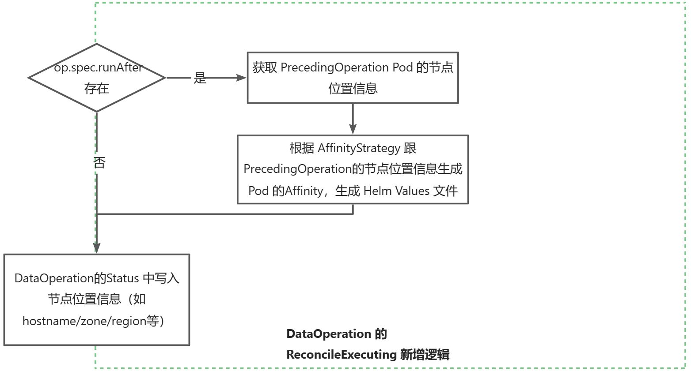

# DataFlow中的Data Operation Pod 间的亲和性

## 动机
当前Fluid 支持 DataFlow，多个Data Operation可以顺序执行。但是不同的 Data Operation 的 Pod 在执行时，可能会在不同的节点，导致整体性能不高：

- 如果后面的 Data Operation 能够在前面的 Data Operation 同样的 node/zone/region 上执行，可能会使得性能更好；
## 目标

- 支持 DataFlow 中不同的 Data Operations的 Pod 的亲和性"继承"， 调度到同一个 node/zone/region，提升整体的 DataFlow 的性能；
- 支持不同的亲和性"继承"策略，默认“”（空值），保持现状不变，可选 require / prefer；
- CRD 支持设置 require/prefer 的 node label，用于亲和性匹配，默认使用 `kubernetes.io/hostname` 的label；
## 设计
### 流程图
对于 Data Operation 的 Reconcile 逻辑，在 Executing 阶段，主要新增以下流程：

- Data Operation 在 Status 中存储运行时 Pod 的亲和性；
- Data Operation 运行时 Pod 的亲和性，**根据 AffinityStrategy 添加从上一个 Data Operation 中匹配的亲和性**；



### CRD 定义
DataOperation 的定义中，需要添加相应字段：
```go
// the referent operation
type OperationRef struct {
    // Added Field.
    // Namespace specifies the pod affinity strategy with the referent operation.
    // +optional
    AffinityStrategy *AffinityStrategy `json:"affinityStrategy,omitempty"`
}
type OperationStatus struct {
    // Added Field.
    // Affinity stores the operation pod's affinity. Fluid will inject the "kubernetes.io/hostname" NodeSelectorTerm.
    // +optional
    Affinity *corev1.Affinity `json:"affinity,omitempty"`
}

// The following are all newly added codes.
type AffinityPolicy string

const (
	DefaultAffinityPolicy AffinityPolicy = ""
	RequireAffinityPolicy AffinityPolicy = "require"
	PreferAffinityPolicy  AffinityPolicy = "prefer"
)

type AffinityStrategy struct {
    // Policy one of: "", "require", "prefer"
    // +optional 
    Policy AffinityPolicy `json:policy,omitemtpy"`

    // Require define the matching label names when Policy is 'require'.
    // use "kubernetes.io/hostname" laby default.
    // +optional 
    Require []string `json:"require,omitempty"`
    
    // Require define the matching label names and weights when Policy is 'prefer'.
    // use "kubernetes.io/hostname" name and weight 100 by default.
    // +optional 
    Prefer  []Prefer `json:"prefer,omitempty"`
}

type Prefer struct {
    Name   string `json:"name"`
    Weight int    `json:"weight"`
}
```

### 亲和性匹配继承逻辑
Data Operation 在生成 Helm Values 文件时，需要**根据上一个 DataOperation Status 中 Affinity 字段，设置自己 Pod 的 Affinity字段**：

- 每个 Data Operation 的每个实现引擎，都要新增该逻辑；

**每个 Operation 的 StatusAffinity 和执行时的 PodAffinity 的计算公式**如下：

- $StatusAffinity(Op) = PodAffinity(Op) + NodeNameAffinity$

  - $ NodeNameAffinity $ 是添加的节点名称匹配的亲和性，为了具备能**将 DataFlow 中的 DataOperation 调度到同一个节点执行的能力，**形式如下：
    - 如果 Op A 是个分布式任务（多个Pod同时执行），此时不止一个节点，$ NodeNameAffinity $  为 `nil`

  ```yaml
  matchExpressions:
  # 集群部署时会自动给节点打上 kubernetes.io/hostname的标签
  - key: kubernetes.io/hostname
    operator: In
    values:
    - ${A_pod_spec_nodename}
  ```

- $PodAffinity(Op) = Op.Spec.Affinity + MatchedAffinity(Op, StatusAffinity(Op.Referent))$

  - 如果 `Op` 没有前置操作，则 $MatchedAffinity$ 返回 `nil`；

  - `MatchedAffinity` 伪代码逻辑：

```go
func MatchedAffinity(current DataOperation, prevOpStatusAffinity *corev1.Affinity) *corev1.Affinity {
    policy := current.Spec.RunAfter.AffinityStratgey.Policy

    // 1. 默认不配置，不继承任何亲和性
    if policy == "" {
        return nil
    }
    
    // 2. require 亲和性继承
    if policy == "require" {
        // 不执行继承的亲和性Key，使用 "kubernetes.io/hostname"
        if current.Spec.RunAfter.AffinityStratgey.Require == nil {
            current.Spec.RunAfter.AffinityStratgey.Require = []string{"kubernetes.io/hostname"}
        }
        for _, label := range(current.Spec.RunAfter.AffinityStratgey.Require) {
            // 根据 label name 匹配相关的 affinity
            affinityTerms := getMatchedAffinity(label, prevOpStatusAffinity.NodeAffinity)
            // 转为 NodeSelectorTerm (require)
            return transfromToNodeSelectorTerm(affinityTerms)
        }
    }
    
    // 3. prefer 亲和性继承
    if policy == "prefer" {
        if current.Spec.RunAfter.AffinityStratgey.Require == nil {
            current.Spec.RunAfter.AffinityStratgey.Require = []Prefer {
                {
                    Key: "kubernetes.io/hostname",
                    Weight: 100,
                },
            }
        }
        for _, prefer := range(current.Spec.RunAfter.AffinityStratgey.Prefer) {
            // 根据 label name 匹配相关的 affinity
            affinityTerms := getMatchedAffinity(prefer.Name, prevOpStatusAffinity.NodeAffinity)
            // 转为 PreferredSchedulingTerm，并设置 Weight
            return transfromToPreferredSchedulingTerm(prefer, affinityTerms)
        }
    }
}
```


## 相关
DataOperation 的 Pod 不使用 Webhook 进行亲和性注入（Serverful/Serverless）。
