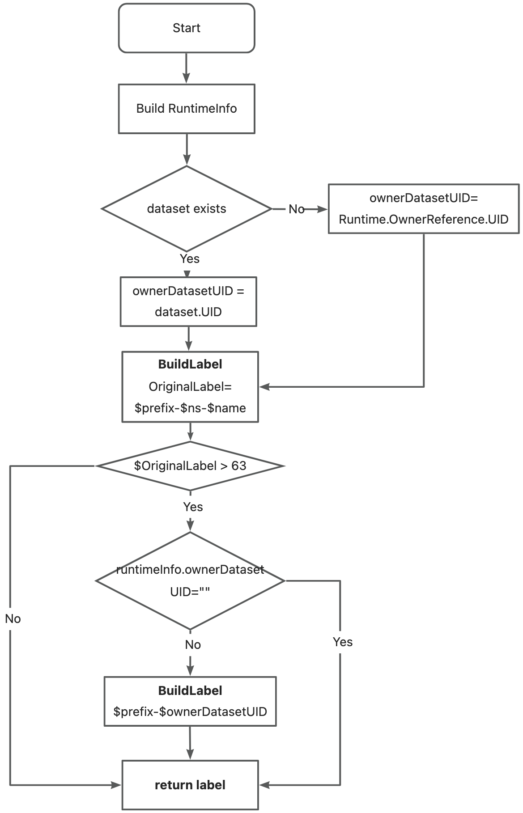

# Fluid label机制重构：支持长namespace/name下的资源创建与统一查询

## 背景

目前Fluid设计并利用了一系列label机制，完成了一些控制链路的功能实现，
比如fusePod的启动、fluid pvc的标志识别等等，在目前的label定义中存在以下问题：

* 有很大一部分label的key和value都是由`$prefix-$namespace-$name`构成的，
在长namespace/name的组合下可能会导致label的key或者value在拼接后，
超过了k8s的schema 63最大字符长度的限制，导致资源的创建失败。
* 部分label key/value的构建仍有runtime重复实现，没有收敛到一个统一的方法中。
* 目前Fluid所创建的资源种类较多，目前未有一个通用的、仅作为元信息不参与控制链路的统一标签，
用于dataset关联资源的统一查询

## 提案

### 新增用于关联资源查询的统一标签

该提案中希望为dataset及其所属的资源（dataset，runtime，configmap，pods，workload）都打上一个统一的资源标签，
方便用户在筛选dataset及与该dataset关联的资源时使用，该标签不应参与任何控制链路，仅作为元信息。

在设计该标签时，我们首先考虑的是是否能复用已有的label `fluid.io/dataset`，该标签目前仅作用于worker pod，
并且用于worker pod间反亲和性打散的作用，不适合将该标签作为元信息打给所有资源。因此我们引入了一个新的标签`fluid.io/dataset-id`，
作为Dataset的唯一标识，该标签对应的value有两种取值方式。

* `$dataset.Namespace-$dataset.Name`
  该方式具备易读性，作为首要的取值方式。
* `$dataset.UID`
  当`$dataset.Namespace-$dataset.Name` 的取值方式，超过Kubernetes对于label key/value最大63个字符长度限制时，会采用该种取值方式作为替代。

该label `fluid.io/dataset`会在runtime reconcile的过程中，patch到runtime/dataset上，并在后续所有关联资源创建时携带。
伪代码设计如下：
``` shell
dataset = getDatasetByKubeClient(name, namespace)
if !runtime contains dataset-id:
  labelKey = fluid.io/dataset-id
  labelValue = $namespace-$name
  if len(labelValue) > 63:
    labelValue = $dataset.UID
  patch(labelKey, labelValue, runtime)
  patch(labelKey, labelValue, dataset)
```
添加该label后，用户可以通过以下方式，统一查询所有与dataset相关联的资源，该标签对应的value可以在已知dataset的label中获取，
也可在Node的标签中获取：
``` shell
$ kubectl get all -l fluid.io/dataset-id="$value"
```

### 解决已有label构建方式长度超限问题

现有以下的label涉及长度超限问题：
``` yaml
fluid/f-$namespace-$name: true
fluid/s-$namespace-$name: true
fluid/h-$runtimeType-$storageType-$namespace-$name: true
fluid_exclusive: $namespace_$name
fluid/dataset: $namespace-$name
```

为了解决namespace/name拼接后作为label的value或者key，长度超限导致fluid相关资源创建失败的问题，
本方案计划用根据一个与dataset唯一关联的ID作为fluid创建资源label的key/value元素，
该ID的构建方式与2.1.中相同，复用其中关于dataset-id的定义，利用`datasetId`替换现有label中`$namespace-$name`的组合：

``` yaml
# datasetId = $namespace-$name or $datasetUID
fluid/f-$datasetId: true
fluid/s-$datasetId: true
fluid/h-$runtimeType-$storageType-$datasetId: true
fluid_exclusive: $datasetId
fluid/dataset: $datasetId
```

label改造后的构造流程如下：



label改造后资源信息示例如下：
``` yaml
apiVersion: data.fluid.io/v1alpha1
kind: Dataset
metadata:
  labels:
    fluid.io/dataset-id="baf88728-3e6d-4115-a2e3-75407679de13"
  finalizers:
  - fluid-dataset-controller-finalizer
  name: alluxio-oss
  namespace: overlimit-1111111111111111111111111111111111111111111111111111
  uid: baf88728-3e6d-4115-a2e3-75407679de13
---
apiVersion: v1
kind: PersistentVolumeClaim
metadata:
  labels:
    fluid.io/dataset-id="baf88728-3e6d-4115-a2e3-75407679de13"
    fluid.io/s-baf88728-3e6d-4115-a2e3-75407679de13: "true"
    name: alluxio-oss
    namespace: overlimit-1111111111111111111111111111111111111111111111111111
---
apiVersion: appV1
kind: Statefulset
metadata:
  labels:
    fluid.io/dataset-id="baf88728-3e6d-4115-a2e3-75407679de13"
    fluid.io/dataset="baf88728-3e6d-4115-a2e3-75407679de13"
```