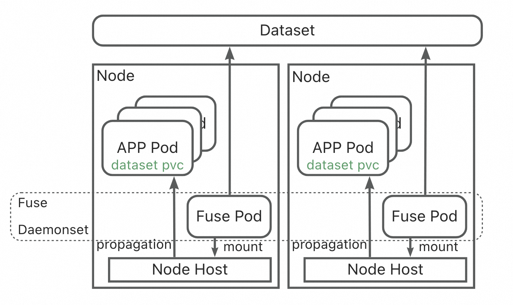

# Runtime Fuse UpdateStartegy - OnIdle Design Proposal

## Background and Motivation

Fluid provides Kubernetes users with a simple and efficient cloud-based data access acceleration solution. It is compatible with various heterogeneous data engine caching systems deployed and operated in cloud-native environments, facilitating user interaction with underlying storage systems and enabling seamless data access. 

During this process, Fuse Pods provide applications on their respective nodes with the ability to access data defined in a Dataset through POSIX interfaces. These container images often require iterative upgrades, which users can trigger by modifying the Fuse Image configuration in the Runtime. 



However, in the current Fluid process for handling Fuse image updates in the Runtime, Fuse Pods are managed in the cluster as DaemonSets. To prevent immediate rolling upgrades that could disrupt business operations when the Fuse image in the Runtime is updated, the upgrade strategy for DaemonSets is set to OnDelete. This requires users to manually determine when Fuse updates on a node will not impact business operations and then manually delete the Fuse Pod to trigger the DaemonSet to rebuild the new Pod with the newly configured image version. This approach significantly increases operational costs, especially in large-scale clusters.

This design primarily proposes an OnIdle Fuse Pod update strategy. Under this strategy, the Fluid Framework will automatically trigger the reconstruction and upgrade of Fuse Pods when they are in an idle state on a node, with no application Pods accessing data through them. Users are unaware of this process.

## Goals


**Implement incremental upgrade of Fuse image after update:** 
  
After updating the Fuse image in JuiceFSRuntime, all newly created Fuse Pods will use the new image.

**Implement legacy upgrade of Fuse image after update:** 
  
  Support two legacy upgrade modes:

* OnDelete Mode [Default]: The user needs to manually delete the Fuse Pod, and then the Fuse DaemonSet will create a new Fuse Pod and apply the new image. The behavior of business interruption is controlled by the user.
  
  


*  OnIdle Mode: After the Fuse Pod has completed the Unmount operation, the existing Fuse Pod is deleted and a new Pod is rebuilt with a new image. This process does not cause any business interruption.


* Implement the solution to minimize the request pressure on the API server as much as possible, and ensure eventual consistency.


## Design

### NEW API

* updateStrategy defined in Runtime

_This upgrade strategy is supposed to apply to all Runtimes, but currently, only JuiceFSRuntime can sense and respond to changes in the Fuse Image during the Fluid sync process._

```yaml
apiVersion: data.fluid.io/v1alpha1
kind: JuiceFSRuntime
metadata:
  name: jfsdemo
spec:
  fuse:
    updateStrategy: OnDelete[Default]/OnIdle
```

* New Annotation defined in PVC of dataset which will be updated when fuse image is changed

```yaml
fuse.runtime.fluid.io/image-version: $fuse.image:$fuse.imageTag
```

* New Env defined in Fuse Daemonset which will be updated when fuse image is changed

```yaml
env:
- name: RUNTIMEINFO_FUSE_IMAGE_VERSION
  value: $fuse.image:$fuse.imageTag
```

* New Volume/VolumeMount defined in the helm template of Fuse Daemonset 

```yaml
  volumeMounts:
    - name: juicefs-fuse-mount
      mountPath: {{ .Values.fuse.hostMountPath }}
      mountPropagation: Bidirectional
  +   - name: juicefs-fuse-meta
  +     mountPath: {{ .Values.fuse.hostMetaPath }}
  volumes:
    - name: juicefs-fuse-mount
      hostPath:
        path: {{ .Values.fuse.hostMountPath }}
        type: DirectoryOrCreate
  + - name: juicefs-fuse-meta
  +   hostPath:
  +     path: {{ .Values.fuse.hostMetaPath }}
  +     type: DirectoryOrCreate
```

* New PostStartCmd defined in the helm template of Fuse Daemonset

```yaml
  lifecycle:
    {{- if .Values.fuse.postStartCmd }}
    postStart:
      exec:
        command: ["sh", "-c", "{{ .Values.fuse.postStartCmd }}"]
    {{- end }}
```

in which postStartCmd is defined as following:

```go
.Values.fuse.postStartCmd =fmt.Sprintf("if [ ! -z $%s ]; then echo $%s > %s; fi",
common.EnvRuntimeFuseImageVersion,
common.EnvRuntimeFuseImageVersion,
GetMetadataFuseImageVersion(namespace, name, runtimeType),
)
```


### Workflow


1. User creates dataset, runtime (with fuse updateStrategyOnIdle), and business workload:

    1.1 Fluid generates a fuse daemonset with the update strategy OnDelete, sets the environment variable RUNTIMEINFO_FUSE_IMAGE_VERSION, and updates the corresponding PVC with the annotation fuse.runtime.fluid.io/image-version. Additionally, Fluid labels the node where the workload pods are scheduled with the fuse daemonset's nodeSelector to scale up the fuse pod.
  
    1.2 During the startup process, the fuse pod writes the value of env:RUNTIMEINFO_FUSE_IMAGE_VERSION into the metadata file.

2. User updates fuse image in runtime:

    2.1 Fluid updates the fuse daemonset image, modifies the environment variable RUNTIMEINFO_FUSE_IMAGE_VERSION, and changes the annotation fuse.runtime.fluid.io/image-version of the corresponding PVC.

    2.2 Due to the fuse daemonset's OnDelete UpdateStrategy, the fuse pod is not rolled out immediately, and the metadata file still reflects the old image version.

3. User deletes business workload:

    3.1 During the Fluid CSI NodeUnstage process, Fluid detects that the fuse pod is not utilized by any workload pod. Additionally, it notices the image version in the metadata file does not match the latest image version in the PVC annotation. Consequently, Fluid CSI will remove the fuse daemonset nodeSelector label from the current node to scale down the corresponding fuse pod.

4. User creates new business workload:

    4.1 Fluid labels the node where the new workload pods are scheduled with the fuse daemonset's nodeSelector to scale up the fuse pod using the new image.