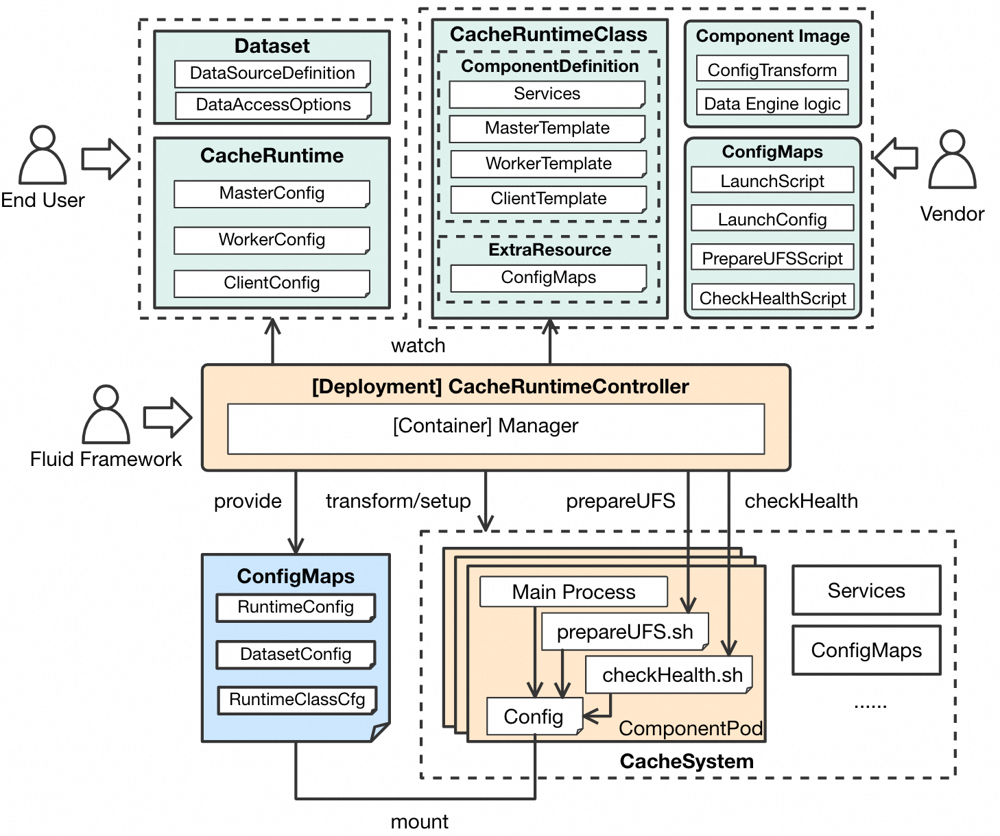
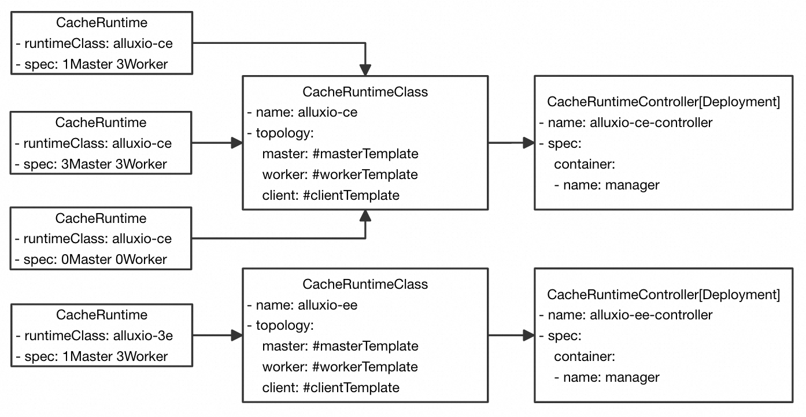
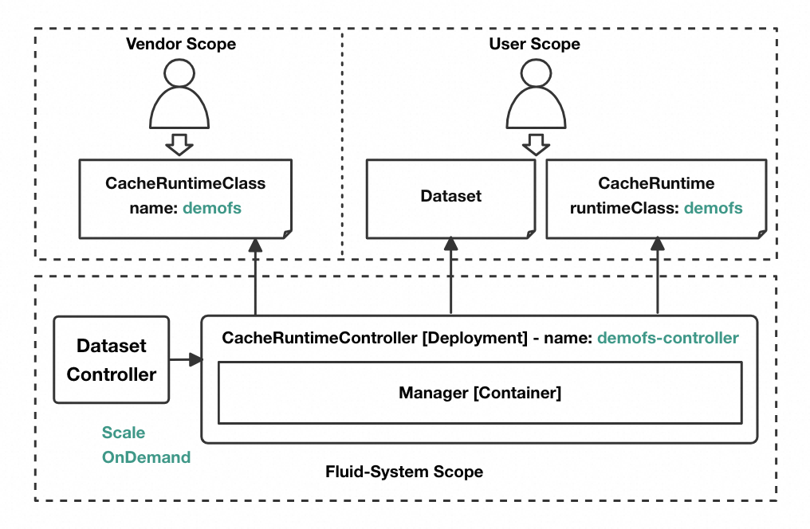

# CacheRuntime Proposal

## 背景

Fluid为Kubernetes用户提供一套简单高效的云上数据访问加速方案，
通过一套通用的API设计，兼容多种异构数据的数据引擎缓存系统在云原生环境中的部署与运维，方便用户通过缓存系统与底层存储系统交互，打通数据访问链路。
目前Fluid通过Code in Tree的方式，扩展兼容多种分布式缓存引擎，包括Alluxio、Juicefs、JindoFS、Vineyard等，
并为每种runtime都开发了独立的runtimeController负责对应runtime的在Kubernetes集群中的全生命周期管理。

随着Fluid的发展，除了上述已经集成的数据引擎外，有越来越多社区主流的数据引擎在未来可以集成进Fluid，例如CubeFs、DragonFly等，利用Fluid可以帮助这些非云原生环境的数据引擎，在云原生环境内构建起分布式数据缓存系统，向最终用户提供统一的使用界面，提供数据访问加速的能力的同时，也能兼容Fluid已有的数据集编排、操作能力。
因此我们希望能够提供一种通用的数据引擎缓存系统的接入机制，降低非云原生领域数据引擎开发人员将其数据引擎接入到云原生环境中的学习和开发成本。
另一方面我们也希望能够借此机会重构现有的runtimeController的实现，收敛API定义和API行为，便于后续项目的健康发展。

### 现有问题

* 从缓存系统开发者(Vendor)角度，现阶段在将新的数据缓存引擎接入到fluid当中时，
Vendor需要编写一个完整的Runtime Controller与Fluid对接，这一方面要求缓存系统开发者具备Kubernetes controller-runtime的相关开发知识。
另一方面由于目前Fluid RuntimeController代码的冗余度较高，一些本应由Fluid提供的统一控制面逻辑，
例如调度、生命周期管理、状态更新的逻辑，每个RuntimeController都需要重复实现，
因此这就要求开发者需要了解Fluid 所有CRD和对应RuntimeController的全链路工作机制，
这大大增加了存储提供者的学习成本和开发对接成本。
* 从Fluid(Fluid Framework)的角度，随着runtime的接入，runtime的crd类型也在不断增加。
同时Code in Tree的对接方式，也使整个系统代码迭代、维护、管理的复杂度逐渐变高，
也会使得对于同一个CRD API的实现标准难以统一，并将runtime的升级和维护与Fluid的版本发布相耦合，
不利于runtime自身迭代的同时，也需要Fluid 为runtime的代码负责。
* 从Fluid的最终用户(User)的角度，过多的runtime crd，
每个runtime crd都有自己不同的api定义或者对于一个相同的api背后行为并不一致，会增加他们的学习理解成本，提升了使用复杂度。

### 目标
本提案期望Fluid能够提供一种通用的分布式缓存系统接入机制，降低开发者将分布式缓存系统接入云原生环境的复杂度和学习成本，也简化用户在Kubernetes集群内对存储缓存引擎使用体验
满足用户使用Fluid访问通用存储系统缓存引擎的需求，兼容Fluid对缓存系统已有的数据编排、数据操作的能力。

* 功能性目标
  * Fluid提供缓存系统的通用接入机制，Vendor无需关心Kubernetes层面的逻辑，仅需要定义分布式缓存系统的拓扑模板，
    进行少量数据面相关的脚本开发工作，即可将分布式缓存系统接入到Fluid当中；
  * 对于架构复杂的缓存系统，未来Vendor可通过实现自定义CacheRuntimePlugin完成接入；
  * 兼容现有runtime接入（Alluxio，Juice，Jindo，Vineyard...），最终Fluid仅保留CacheRuntime，
  现有的JindoRuntime、AlluxioRuntime，JuiceRuntime等均会以**CacheRuntime**形式存在，使得Fluid对用户提供能力的概念进一步清晰。
  最终 Fluid提供两个Runtime CRD，**CacheRuntime**负责数据缓存系统的接入与**ThinRuntime**负责数据源的接入。
* 非功能性目标
  * 代码接口层抽象、冗余实现收敛：将目前Fluid runtimeController的冗余接口实现统一收敛至CacheRuntimeController中。
  将需要runtime自定义的接口实现，Fluid提供默认实现的同时，也保留供Vendor自定义实现的能力；
  * 减少Runtime Vendor的学习、开发和接入成本；
  * Runtime API&默认行为统一：控制链路API行为由CacheRuntimeController控制，Runtime Vendor仅需定义缓存系统的拓扑，
  或者开发必要的原子接口；
  * 减少不成熟、不规范的Runtime对Fluid代码、设计的入侵；
  * 使runtime开发、维护职责边界更清晰，runtime的问题修复、升级与fluid代码节藕。

## 整体设计

一句话概括：在本提案中，提供两个新的Fluid CRD **CacheRuntime**与**CacheRuntimeClass**，用户通过CacheRuntime CRD可以创建多种类型的缓存系统，通过在其中指定runtimeClass，来选择由vendor提供的缓存系统部署模板，
Fluid会根据用户在CacheRuntime中的缓存系统配置及所使用的RuntimeClass部署模板，构建起对应的缓存系统，并根据用户Dataset中数据源的定义，在系统中完成数据的接入、访问、缓存和管理。

### CacheRuntime

CacheRuntime与现有JindoRuntime、AlluxioRuntime、JuiceFSRuntime概念模型、用途一致，api定义基本类似，由最终用户进行缓存系统的相关配置。
CacheRuntime的短期目标为承载后续新增数据缓存系统的对接，长期目标为承载目前已有Runtime（Alluxio，Juice，Jindo，Vinyard，Efc）的迁移，
Fluid最终只保留CacheRuntime & ThinRuntime两个Runtime相关的CRD，runtime vendor均以OutTree的CacheRuntimeClass方式接入，
代替现有In Tree的RuntimeController，由Vendor为CacheRuntimeClass负责；

### CacheRuntimeClass

纵观目前所有RuntimeController的实现，开发者将自己的缓存系统接入到fluid中需要实现一个完整的RuntimeController，RuntimeController中对于runtime的reconclie过程由Fluid定义的26个Runtime生命周期管理接口组成，
可以将接口分为以下的工作
* **控制链路**

  * Setup 缓存系统：基于Vendor自定义的HelmTemplate，根据用户runtime/dataset的配置Transform出values.yaml，最终通过helm install Setup起缓存系统
       * workload（master，worker，fuse）image，启动参数，workloadType，缓存Volume等
       * service
       * configmap (启动脚本\运行时配置)
  * 确认缓存系统状态，与Dataset进行绑定
  * 对于runtime，dataset的状态更新
     * 整体状态（status，phase，condition）
     * 调度状态（scheduleInfo，label）
     * 缓存状态（cache status：total，used，free）
     * 挂载点状态（mountPoint status）
  * 对于缓存系统的调协
     * 处理Runtime的更新
     * 处理Runtime worker的扩容
     * 处理挂点的更新

  * 对于DataOperation的处理：基于自定义的HelmTemplate，根据用户dataOperation/dataset/runtime的配置Transform出values.yaml，
  通过helm install创建job/cronJob

* **数据链路**
  * 将Runtime/Dataset api转换为缓存引擎可认的参数（日志、quota、数据源等配置，通过configmap传递，供容器内进程启动时识别）
  * 确认缓存系统数据面是否就绪
  * 挂载底层文件系统
  * 删除缓存系统时，清理缓存
  * 上报缓存系统容量指标

MasterSlave和P2P两种拓扑架构可以涵盖目前绝大多数的缓存缓存系统，因此各个RuntimeController中大部分的拓扑定义和控制链路实现逻辑几乎是完全一致，不同的是创建缓存系统时，所用的镜像、启动脚本、配置参数、服务发现方式上的差异 ，这部分的配置完全可以从代码中移到一个缓存系统模板中来配置，重复的控制链路由Fluid来提供公共实现，无需Vendor来关心。

通过上述拆分，一方面可以减少Vendor接入缓存系统时的代码开发工作量和学习成本，另一方面对于CRD API行为也能做到收敛，避免不同runtime对于同一runtime/dataset api行为的实现和处理逻辑存在差异，最终也能降低Fluid项目的复杂度和代码冗余度。

为了实现此目的，我们希望能够有一个缓存系统的拓扑模板CRD供Vendor来配置，Fluid Framework根据该拓扑模板，结合最终用户的对于Runtime的配置，
相当于由Vendor来提供分布式缓存系统的架子和默认参数，最终用户进行分布式缓存系统的资源、调度等specified的配置，Fluid Framework根据两者，
完成分布式缓存系统的搭建、健康检查、更新、扩容。

为支持这样一个缓存系统拓扑模板的定义，我们计划提供一个新的Fluid CRD - CacheRuntimeClass，该CRD中面向Vendor，提供了以下配置

* topology:
  * master:
    * replicas
    * workloadType
    * podSpecTemplate
    * services
  * worker：
    * replicas
    * workloadType
    * podSpecTemplate
    * services
    * tiredStore
  * client：
    * workloadType
    * podSpecTemplate
* extendResources:
  * configmaps
* plugins:

## 责任划分

通用CacheRuntime的设计与实现过程，可以视为将以往Runtime开发工作进行分类，以明确开发及责任边界。Fluid负责的越多，API行为约收敛，但Vendor对于缓存系统定义的自由度越小。相反的，Fluid负责的越少，API行为更多由Runtime实现，虽然提供了更高的自由度和扩展性，更容易满足复杂需求，但API行为难以收敛，
造成用户使用不同runtime体验差异的同时，Vendor所需要复杂的开发工作就越多。在cacheRuntime的涉及中，我们希望将与云原生Kubernetes相关的控制面工作全交由Fluid Framework来负责，Vendor仅需要负责容器内数据面的工作，按照这个思路，将上文中的工作重新进行了调整

按照此设计，Vendor不需要关心控制面的实现，即缓存系统的Helm template定义、transform与Setup过程完全由Fluid Framework提供的CacheRuntimeController负责，Vendor仅需提供RuntimeClass及其中Runtime镜像和相关的启动配置。
* 优点：Vendor几乎没有任何Fluid相关的开发工作，也不需要过多了解Kubernetes相关的背景知识，仅需要关心Runtime自身逻辑即可。
* 缺陷：缓存系统的拓扑与实例声明由Fluid定义，vendor无自定义空间，仅支持简单的缓存系统拓扑，并且需要Vendor遵守全托管方案的约束与规则定义。为弥补该缺陷，后续Fluid会扩展CacheRuntime，基于当前cacheRuntime的整体设计，
  提供CustomCacheRuntimePlugin机制，在该机制下会为vendor提供更多自定义空间。

在做工作切分的时候难免涉及到流程涉及到控制面与数据面进行交互，需要Vendor定义数据面，fluid来触发的动作，主要包含以下三种：
  * mountUFS: 当缓存系统Setup完成后，部分缓存引擎需要将底层文件系统挂载进缓存系统实例
  * checkRuntimeReady: 缓存系统数据面是否已经就绪，可以提供访问服务
  * cleanCache: 当dataset删除时，清理HostPath类型的缓存目录
以上三个动作，需要由Vendor在CacheRuntimeClass中以Configmap的形式提供执行脚本，由Fluid在整个runtime的生命周期管理过程中去触发。

最终EndUser、Vendor、Fluid Framework之间的责任划分如下：

| 角色              | 职责域                                                                                                                                                                                                                                                                                            |
|-----------------|------------------------------------------------------------------------------------------------------------------------------------------------------------------------------------------------------------------------------------------------------------------------------------------------|
| End User        | 1. 声明Dataset: 配置数据源、认证信息、数据调度策略、Options   2. 声明CacheRuntime: 配置要使用的拓扑模板（CacheRuntimeClass），定义使用拓扑模板创建时，模版内组件的资源规格、缓存空间、副本数、配置项等                                                                                                                                                            |      
| Vendor          | 1. 准备RuntimeImage：基于原生数据引擎镜像，封装一层参数转换逻辑，识别Fluid Config转换为Runtime自定义参数    2. 确认拓扑架构，定义CacheRuntimeClass，即缓存系统部署模板，包括：Master/Worker/Client端的PodTemplate，Properties，默认副本数、WorkloadType，用于组件间服务发现的Service，按需定义运行时所需要的Configmap                                                                 |        
| Fluid Framework | 1. 内置通用的CacheRuntime Helm Template   2. 以CacheRuntimeClass为模板，结合CacheRuntime/Dataset的配置，最终生成Helm values，应用与Helm Template进行缓存系统的部署   3. 确认缓存系统的控制面健康状态，与Runtime数据面的就绪状态，确认无误后，将Dataset与CacheRuntime进行Bound操作，该状态可以提供数据访问服务   4. 定期检查缓存系统的健康状态，更新CacheRuntime状态   5. 处理Dataset/CachgeRuntime的更新 |        

     

## 资源关系模型

纵观现有缓存系统的实现，对于同一缓存引擎，最终用户在部署时，可能会由多样化的部署配置，例如
  * MasterSlave架构中 one Master - multi Worker拓扑
  * MasterSlave架构中 multi Master for high available - multi Worker拓扑
  * MasterSlave架构中无Master，无Worker，只有Client拓扑
  * DHT/P2P架构中多worker拓扑
  * DHT/P2P架构中无Worker

  针对此类异构的拓扑配置，资源关系如下：

  如图所示，针对同一拓扑模板，最终用户侧可以根据实际业务情况，在创建runtime时，自定义部署的组件数量，workloadType，资源等。

## 部署模型

* One Kind CacheRuntimeClass - One Controller

