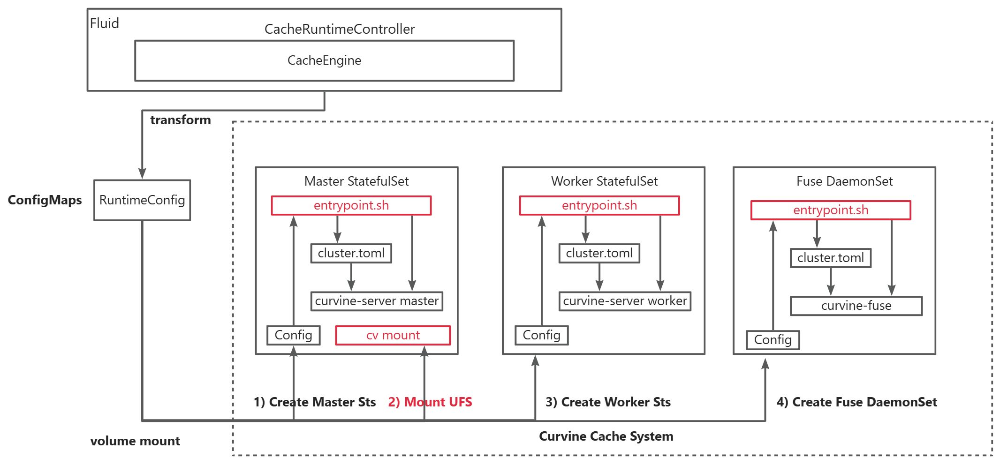
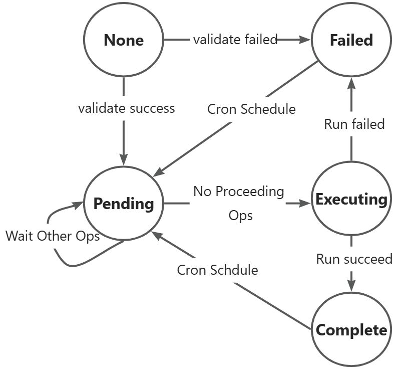
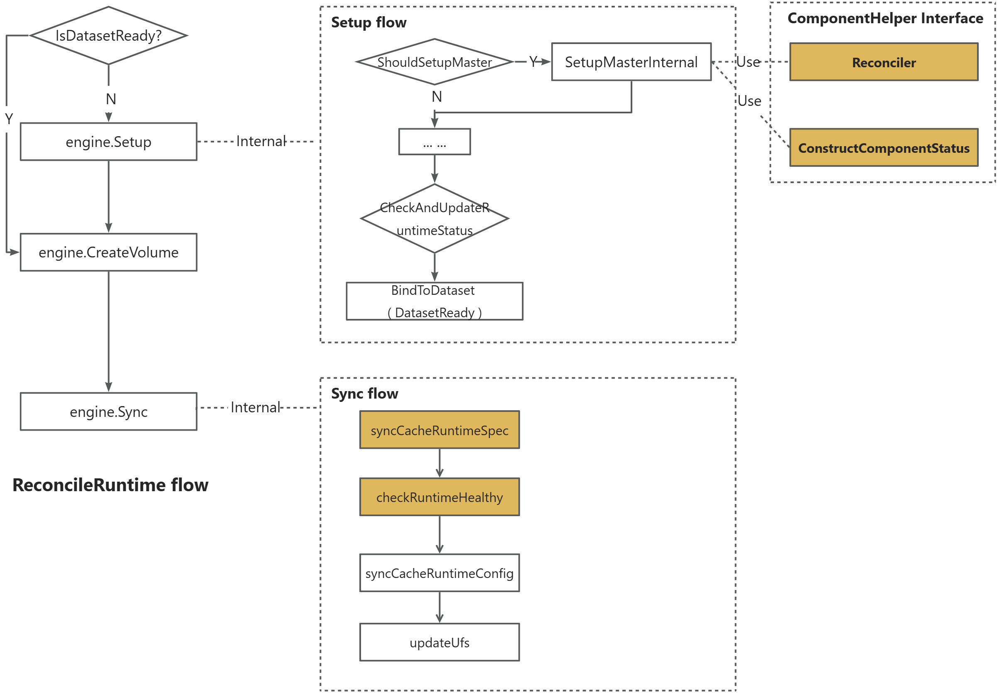

# Proposal: Extend cache runtime interface for full data lifecycle

## 背景

Fluid 提供一种通用的数据引擎缓存系统的接入机制（CacheRuntime），降低非云原生领域数据引擎开发人员将其数据引擎接入到云原生环境中的学习和开发成本。目前仅实现了CRD的定义和基本的Reconcile逻辑，并未与实际的缓存系统（如Curvine/Alluxio）进行联调测试。

此外，当前的 Cache Runtime 接口缺乏对端到端的数据操作和动态 runtime 更改的支持，这迫使用户不得不删除并重新创建数据集以进行日常维护（例如，引擎升级或故障恢复）。这导致了不必要的停机时间、运营开销和糟糕的用户体验。通过扩展接口以管理完整的数据生命周期，并支持就地升级和重建，Fluid能够提供无缝、有弹性和高效的数据管理，从而提高系统可用性，满足云原生数据编排的生产级要求。

## 现有问题

- 当前的Generic Cache Runtime 并未与缓存系统（Curvine等）进行联调，缺乏Curvine Mount的接口定义，POC 工作及测试用例有待完成；
- 当前的Generic Cache Runtime 并不支持DataLoad, DataProcess等数据操作，需要定义标准的 API；
- 当前的Generic Cache Runtime 并不支持 In-Place upgrade and cache rebuild。

## 目标

- 通用的缓存运行时接口能够快速将新引擎集成到 Fluid 中，使平台更具可扩展性和对操作员更友好。
- 完整的数据生命周期并支持就地升级和重建，Fluid 可以提供无缝、弹性和高效的数据管理，提高系统可用性，减少运营摩擦，并符合云原生数据编排的工业级要求。

## 方案

### 1. Generic Cache Runtime 集成 Curvine

### 1.1 Curvine 操作介绍

Curvine 是 Master-Worker 架构，其示例配置如下：

```toml
# master configuration
[master]
meta_dir = "testing/meta"

# master HA raft configuration.
[journal]
journal_addrs = [
    {id = 1, hostname = "master-sts-0.master-sts-svc", port = 8996}
]
journal_dir = "testing/journal"

# Worker configuration
[worker]
dir_reserved = "0"
data_dir = [
    "[DISK]testing/data",
]

[fuse]
mnt_path = "/runtime-mnt/fuse"
```

其 master / worker / fuse 的启动命令如下：

```shell
# Master /entrypoint.sh master start
/app/curvine/lib/curvine-server --service master --conf curvine-cluster.toml
# Worker /entrypoint.sh worker start
/app/curvine/lib/curvine-server --service worker --conf curvine-cluster.toml
# Fuse mount, path is defined at curvine-cluster.toml, or can use --mnt-path parameter.
/app/curvine/lib/curvine-fuse --conf curvine-cluster.toml
```

Curvine 挂载底层文件系统时，需要等缓存系统启动完成后，显式通过命令`cv mount`执行。

### 1.2 扩展 CacheRuntime 的流程定义

Curvine Cache Runtime 中在 SetUp 阶段相关的处理流程如下图所示：

- Cache Runtime 为缓存系统提供 RuntimeConfig，因此Curvine 组件需要**封装原始镜像的启动命令，先进行参数解析生成配置文件，再使用原始的启动命令启动进程**。



但是，目前 Master Sts 启动后，缺少执行 cv mount 进行挂载远程存储的操作和获取缓存基本信息等操作。

- 不同于curvine，Juicefs 是无Master架构，在[启动时就执行 format ](https://juicefs.com/docs/zh/community/getting-started/for_distributed/#4-创建文件系统)，只支持一个远程存储，因此直接在 worker/fuse 的启动命令里执行；

因此，需要扩展 CacheRuntimeClass 定义，增加对 mount UFS 等操作的支持

```go
type CacheRuntimeClass struct {
    // 当前 Cache System 需要定义的操作，以支持 out-of-tree 集成
    ExecutionEntries *ExecutionEntries `json:"executionEntries,omitempty"`
}
type ExecutionEntries struct { 
    // 挂载 UFS 的操作，针对 Master-Slave 架构，需要在 Master 中执行
	MountUFS *ExecutionCommonEntry  `json:"mountUFS,omitempty"`
    
    // 获取缓存信息的操作，如缓存总容量、已使用容量等（Fluid 定义输出格式），针对所有架构的缓存系统
    ReportSummary *ExecutionCommonEntry `json:"reportSummary,omitempty"`
    
    // ... 可扩展增加新的 Entry
}
// 通用的操作项
type ExecutionCommonEntry struct {
    // 执行的命令，必选，会在 Master Pod 中执行
    Command string `json:"command"`
    
    // 执行命令的超时时间（单位：秒），默认（最小值）为 5s.
    Timeout int `json:"timeout,omitempty"`
}
```

集成 Curvine 在 SetUp 阶段所涉及的工作任务有：

1. 提供启动脚本，将 Fluid 提供的 RuntimeConfig 转化为 Curvine 所使用的配置文件；
   - 拟采用 go template 要求的格式定义 Curvine 的配置文件，并进行替换；
1. 添加 Mount UFS 步骤，在 Master Sts 启动完成后，进入 Master Pod 执行 cv mount 操作；
   - **mount 操作在 CacheRuntimeClass 中定义，指定在特定的角色（如Master）的Pod 中执行指定的命令，以RuntimeConfig文件为参数。**
   - 对于 JuiceFS 缓存系统，不需要单独执行 mount 参数，在 CacheRuntimeClass 中不定义即可；
1. 对于 Worker/Client 而言，当前在创建时提供的上下文（RuntimeConfig）中，仍缺乏 Master Service 的信息，需补充以便与其通信。
1. 添加 ReportSummary 操作，当缓存系统 Ready 时，获取缓存信息并更新 DataSet 的 Status 字段。

此外，如果修改了 DataSet 的 mount path，则需要在 Sync 阶段，进行 Ufs Update，此处逻辑可以参考已有的 TemplateEngine 实现。

- 要求 MountUfs 中定义的 Command，能够根据当前的挂载信息和目标挂载信息，进行 umount 和 mount 操作。

### 2. 定义标准API，支持 DataOperation

针对 DataOperation（DataLoad/DataBackup/DataMigrate/DataProcess），扩展 CacheRuntimeClass 定义，表明支持哪些数据操作：

- DataProcess 的实现跟缓存系统无关，其 CRD 定义中包含镜像及命令，不需要扩展接口定义；
- DataBackup 和 DataMigrate : Curvine 当前不支持这些操作，暂时不实现，接口定义支持后续扩展；
- 因此本项工作定义标准接口，并针对 Curvine 实现 DataLoad；

```go
type CacheRuntimeClass struct {
    // 当前 Cache System 支持哪些数据操作
    DataOperations []DataOperationSpec `json:"dataOperations,omitempty"`
}

type DataOperationSpec struct {
    // Data Operation Name, currently only support DataLoad
    // +kubebuilder:validation:Enum=DataLoad
    Name string `json:"name,omitempty"`

    // The image name for DataOperation executing
    Image string `json:"image,omitempty"`
    
    // Command for image container
    Command []string `json:"command,omitempty"`
    
    // Args for image container
    Args []string `json:"args,omitempty"`
}
```

Fluid 当前针对不同的 DataOperation 已经定义了 Engine 的接口。因此CacheRuntime 的 CacheEngine，需要实现下面的接口，完成相应的数据操作以及状态的流转。

```go
type DataOperator interface {
	Operate(ctx cruntime.ReconcileRequestContext, opStatus *datav1alpha1.OperationStatus, operation dataoperation.OperationInterface) (ctrl.Result, error)
}
```

为了保证与 TemplateEngine 的状态及处理逻辑一致，仍使用五种状态（None/Pending/Executing/Complete/Failed），其状态转换逻辑如下：

  

在核心实现上，与 TemplateEngine 的不同点在于 Executing 阶段 Helm 所用的文件的生成，即需要实现接口

```go
// DataOperatorYamlGenerator is the implementation of DataOperator interface for runtime engine.
type DataOperatorYamlGenerator interface {
	GetDataOperationValueFile(ctx cruntime.ReconcileRequestContext, operation dataoperation.OperationInterface) (valueFileName string, err error)
}
```

针对 operation 的 不同 Type，做不同的处理。DataProcess 不区分缓存系统，可以复用现有的 Helm Yaml 生成逻辑；而其它的 DataOperation 都需要相应的缓存系统镜像及其配置。

- 通过新增的 DataOperationSpec 定义相应 Pod ，启动并执行相应的数据操作的命令，其中 Fluid DataOperation的相关配置信息，会挂载到 /etc/fluid/config/dataop 文件中；


### 3. 支持 In-Place Upgrade 和 Rebuild

Fluid 准备采用类似 OpenKruise 中的 AdvancedStatefulSet 的能力替代现有 Cache Runtime 的 StatefulSet，AdvancedStatefulSet 自身具备原地升级的能力，因此本项工作的内容，是结合 Cache Runtime 的生命周期，梳理相关的改动点，并实现支持原地升级和缓存重建的能力。

Fluid  对于 Cache Runtime 的 Reconcile flow 如下图最左侧所示：



Cache Runtime 中对缓存系统的各个组件（Master/Worker/Client Component）抽象了 ComponentHelper 接口，其接口定义如下:

- 对于 Component 的销毁，采用 OwnerReference 进行管理，因此不用定义接口。

```go
type ComponentHelper interface {
    // reconcile to create component workload
	Reconciler(ctx context.Context, component *common.CacheRuntimeComponentValue) error
    // create RuntimeComponentStatus according to component workload status
	ConstructComponentStatus(ctx context.Context, component *common.CacheRuntimeComponentValue) (datav1alpha1.RuntimeComponentStatus, error)
    // get TopologyConfig according to component workload spec, will be recorded in the Runtime ConfigMap
	GetComponentTopologyInfo(ctx context.Context, component *common.CacheRuntimeComponentValue) (common.TopologyConfig, error)
    // check component exist or not, currently useless
	CheckComponentExist(ctx context.Context, component *common.CacheRuntimeComponentValue) (bool, error)
    // clean up orphaned resources, currently useless
	CleanupOrphanedComponentResources(ctx context.Context, component *common.CacheRuntimeComponentValue) error
}
```

因此，第一点工作是使用 AdvancedStatefulSet 实现上面的接口。

其次，当前的 CacheRuntime 框架中，是通过修改 CacheRuntimeSpec 的定义来修改各个Component的资源对象的（如副本数，环境变量等），当 Spec 发生改变时，需要在 Sync 函数中，新增 syncCacheRuntimeSpec 函数，用于比较当前组件的AdvancedStatefulSet 跟 Spec 定义的差别，并通过 AdvancedStatefulSet 的相应字段的修改，实现原地更新和升级的能力（该能力由 AdvancedStatefulSet 的控制器提供）。同时，新增 checkRuntimeHealthy 函数，根据最新的组件的状态（如目标副本数、可用副本数等信息）更新 CacheRuntime 的 Status 字段。 

